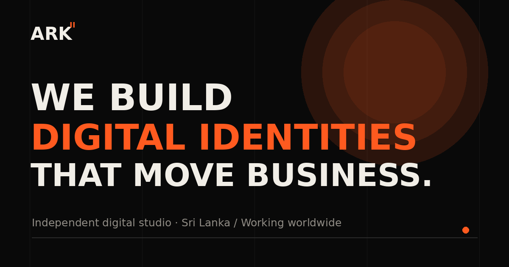

# ARK II

**Premium digital studio website built with React and Vite.**

ARK II is a portfolio-focused digital studio experience designed around premium branding, modern motion, strong visual hierarchy and responsive UX. The project presents ARK II as a contemporary web/design studio rather than a generic template site.

## Project showcase

The repository includes the production visual assets used by the site, including the social preview cover and project imagery.



## What the project demonstrates

- Premium agency / digital-studio positioning
- Responsive, mobile-first interface design
- Component-based React architecture
- Motion-driven interactions and page transitions
- Smooth scrolling with Lenis
- Framer Motion animations
- Structured project showcase content
- Custom visual identity and typography
- Responsive navigation and layouts
- SEO and social-sharing assets
- Production-oriented Vite configuration
- Netlify deployment configuration

## Technology stack

| Category | Technology |
| --- | --- |
| Frontend | React |
| Build tool | Vite |
| Language | JavaScript / JSX |
| Animation | Framer Motion |
| Smooth scrolling | Lenis |
| Icons | Lucide React |
| Styling | CSS |
| Linting | ESLint |
| Deployment config | Netlify |

## Project structure

```text
ark-ii/
├── public/
│   ├── projects/
│   ├── og-cover.png
│   ├── favicon.svg
│   ├── sitemap.xml
│   ├── robots.txt
│   └── site.webmanifest
├── src/
│   ├── components/
│   ├── data/
│   ├── assets/
│   ├── styles/
│   ├── App.jsx
│   ├── App.css
│   ├── index.css
│   └── main.jsx
├── .gitignore
├── eslint.config.js
├── index.html
├── netlify.toml
├── package.json
├── package-lock.json
└── vite.config.js
```

## Design direction

ARK II focuses on a **high-end digital studio aesthetic** rather than a conventional corporate layout.

The design language emphasizes:

- Strong typography
- Large editorial compositions
- Controlled whitespace
- Motion and micro-interactions
- Dark, premium visual treatment
- Clear project storytelling
- Responsive layouts across desktop and mobile

## Local development

### Prerequisites

- Node.js
- npm
- Git

### Install

```bash
npm install
```

### Start development server

```bash
npm run dev
```

### Build

```bash
npm run build
```

### Preview production build

```bash
npm run preview
```

### Lint

```bash
npm run lint
```

## Deployment

The project includes a `netlify.toml` configuration for static deployment through Netlify.

The live deployment is intentionally not hard-coded into this README while the hosting setup is being maintained.

## Portfolio value

ARK II demonstrates the ability to translate a brand concept into a polished frontend experience, combining **React component architecture, responsive design, animation, interaction design and visual storytelling**.

It complements the more systems-focused projects in this portfolio by demonstrating frontend craftsmanship and product presentation.

## License

Portfolio / demonstration project — not licensed for reuse.
