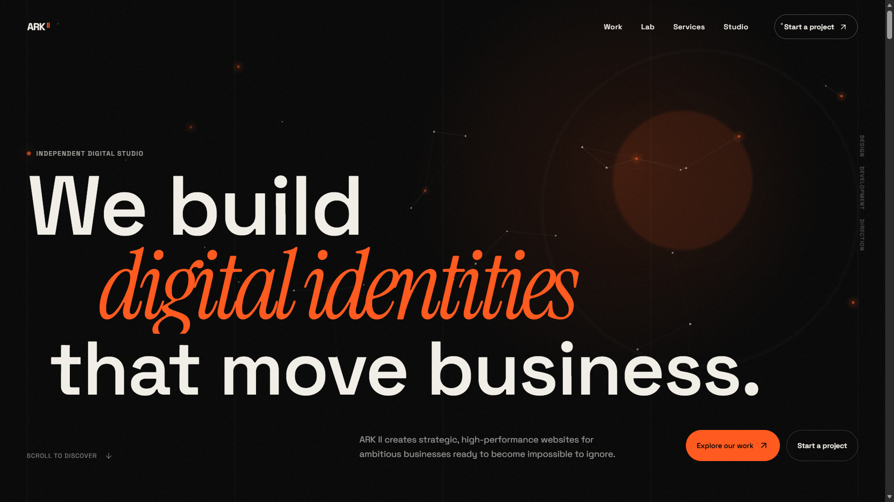
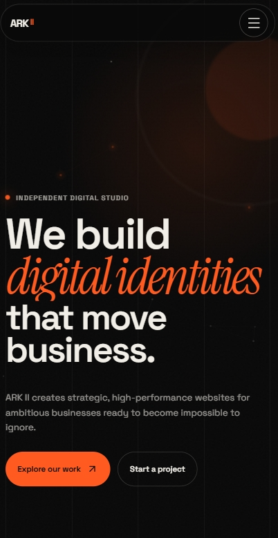
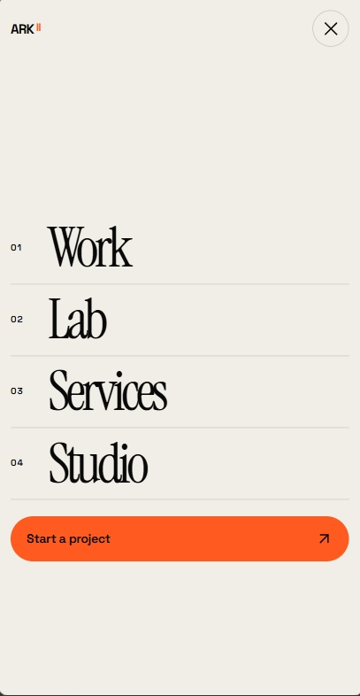
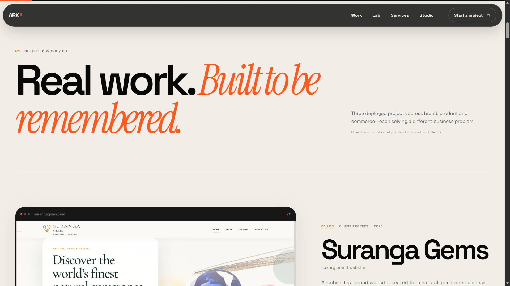
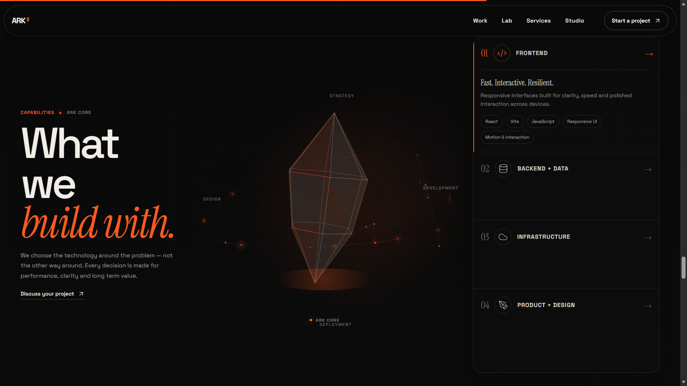
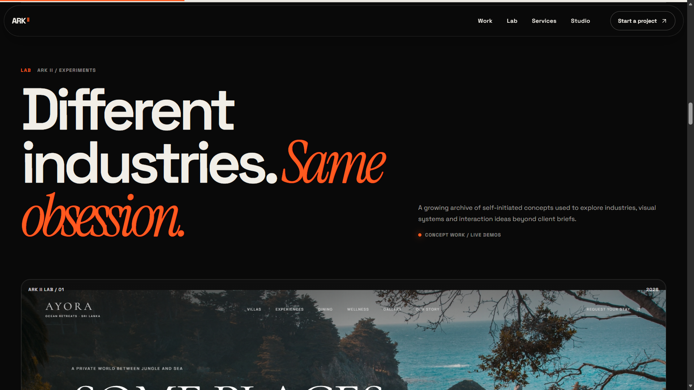
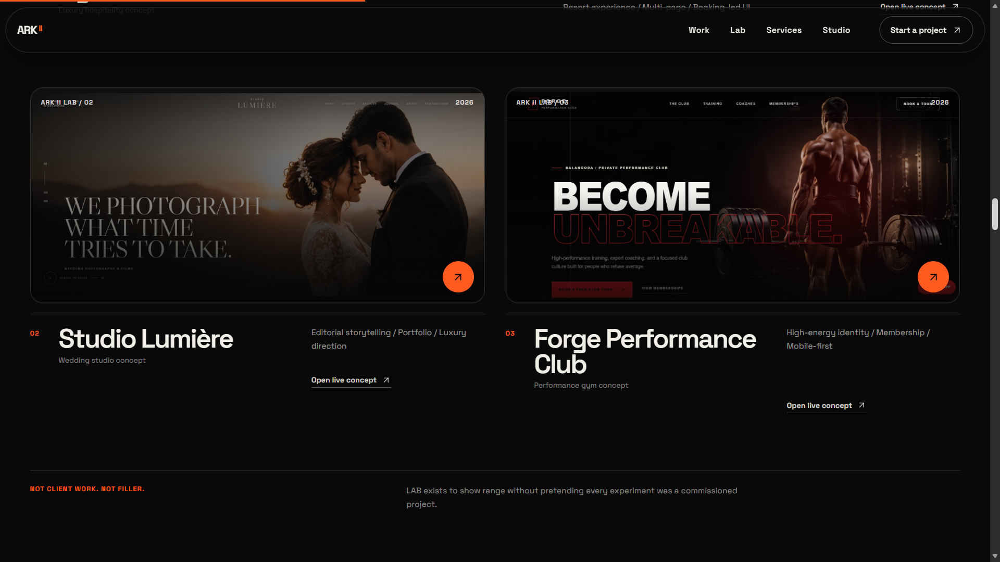
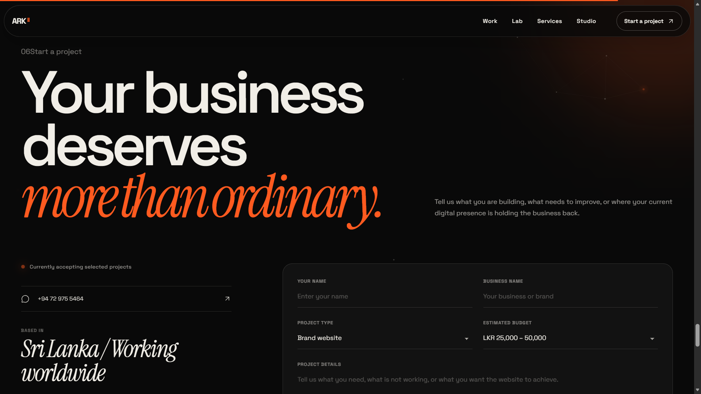
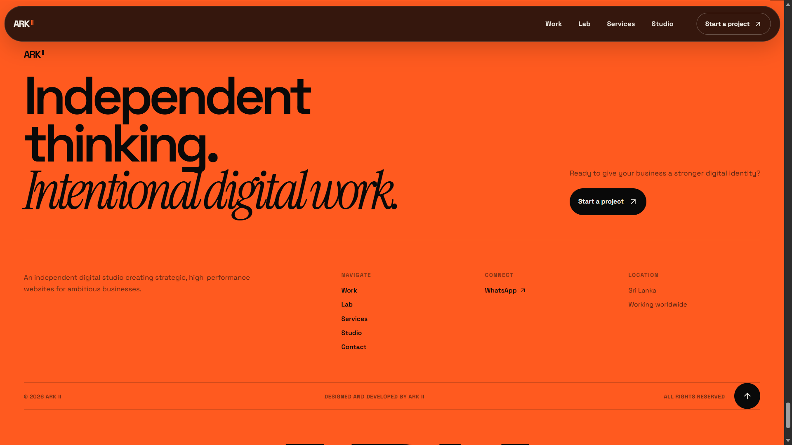
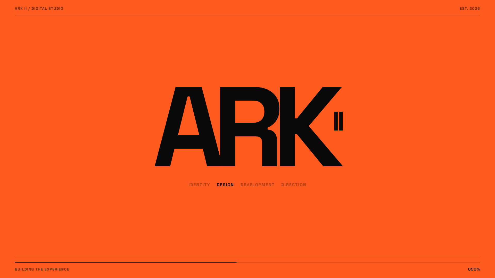

# ARK II

**My personal digital studio and client-facing portfolio website.**

ARK II is the website I designed and built to showcase my web development work, capabilities and selected projects to prospective clients. It serves as both a personal portfolio and a client-facing platform for presenting premium websites and digital experiences I design and build.

Rather than using a generic portfolio template, ARK II was built as a complete branded digital studio experience with its own visual identity, motion system, responsive layouts and project presentation.

## What ARK II is for

ARK II is designed to help prospective clients quickly understand:

- What I build
- The type of websites and digital experiences I can deliver
- My frontend and interaction design capabilities
- Selected projects and experiments
- How to start a project or get in contact

## Project showcase

The repository includes screenshots from the finished interface, including desktop, mobile, navigation, project work, capabilities, lab experiments, contact and loading experiences.

### Hero



### Mobile hero



### Responsive navigation



### Selected work



### Capabilities



### ARK II Lab





### Contact



### Footer



### Loading experience



## Key features

- Premium digital-studio branding
- Client-facing portfolio presentation
- Selected work showcase
- Capabilities / services presentation
- Interactive ARK II Lab section for experiments and creative concepts
- Responsive, mobile-first interface design
- Responsive mobile navigation
- Motion-driven interactions and page transitions
- Smooth scrolling with Lenis
- Framer Motion animations
- Custom visual identity and typography
- SEO and social-sharing assets
- Production-oriented Vite configuration
- Netlify deployment configuration

## Technology stack

| Category | Technology |
| --- | --- |
| Frontend | React |
| Build tool | Vite |
| Language | JavaScript / JSX |
| Animation | Framer Motion |
| Smooth scrolling | Lenis |
| Icons | Lucide React |
| Styling | CSS |
| Linting | ESLint |
| Deployment config | Netlify |

## Project structure

```text
ark-ii/
├── public/
│   ├── projects/
│   ├── og-cover.png
│   ├── favicon.svg
│   ├── sitemap.xml
│   ├── robots.txt
│   └── site.webmanifest
├── docs/
│   └── screenshots/
│       ├── hero.png
│       ├── mbhero.png
│       ├── mbresponsivenavbar.png
│       ├── work.png
│       ├── CAPABILITIES.png
│       ├── lab.png
│       ├── lab2.png
│       ├── contact.png
│       ├── footer.png
│       └── loader.png
├── src/
│   ├── components/
│   ├── data/
│   ├── assets/
│   ├── styles/
│   ├── App.jsx
│   ├── App.css
│   ├── index.css
│   └── main.jsx
├── .gitignore
├── eslint.config.js
├── index.html
├── netlify.toml
├── package.json
├── package-lock.json
└── vite.config.js
```

## Design direction

ARK II focuses on a **high-end digital studio aesthetic** rather than a conventional corporate layout.

The design language emphasizes:

- Strong typography
- Large editorial compositions
- Controlled whitespace
- Motion and micro-interactions
- Dark, premium visual treatment
- Clear project storytelling
- Responsive layouts across desktop and mobile

## Local development

### Prerequisites

- Node.js
- npm
- Git

### Install

```bash
npm install
```

### Start development server

```bash
npm run dev
```

### Build

```bash
npm run build
```

### Preview production build

```bash
npm run preview
```

### Lint

```bash
npm run lint
```

## Deployment

The project includes a `netlify.toml` configuration for static deployment through Netlify.

The live deployment is intentionally not hard-coded into this README while the hosting setup is being maintained.

## Portfolio value

ARK II demonstrates that I can build and ship my own professional client-facing web presence rather than only isolated demo projects. It combines **React component architecture, responsive design, animation, interaction design, visual storytelling and client-oriented presentation** in one production-style frontend project.

## License

Portfolio / personal studio project — not licensed for reuse.
